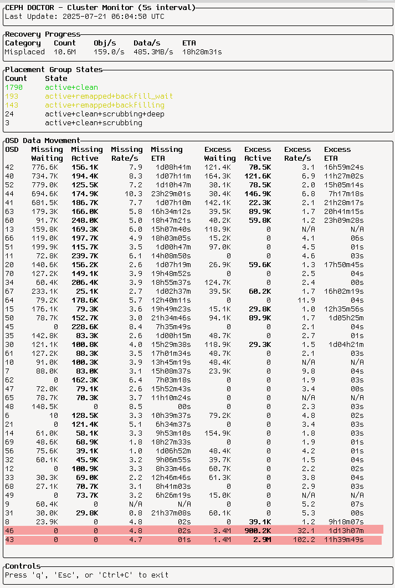
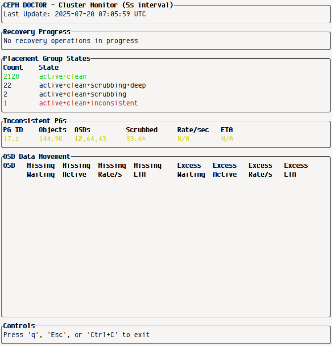
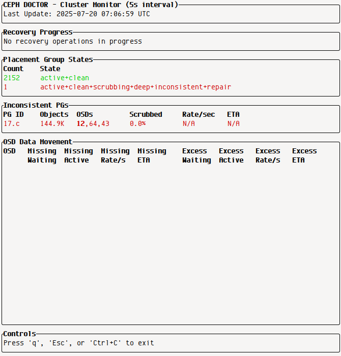

# Ceph Doctor

A Ceph cluster analysis tool for helping with clusters where `ceph -s` shows `HEALTH_WARN` status.

## Overview

The `ceph-doctor` tool provides a `monitor` subcommand that displays a real-time view of the cluster's state, showing how Ceph is working towards resolving the `HEALTH_WARN` condition.

## Demo

### OSD Data Migration

After smartd alerted on bad blocks on two disks we are going to replace them.
We ran:

```console
ceph osd out osd.43
ceph osd out osd.46
```

Now the doctor shows how data is moving away from the 43 and 46 into many
other disks.



### Inconsistant Placementgroup

During scrub, ceph detected an inconsistant placement group. Unfortunately
ceph does not see this a overly problematic, and does not take to repairing
the inconsistency immediagely but rather works on the other scrubbing jobs.



Since we want to see ceph working on a fix, we stop the ongoing scrubbing.

```console
ceph osd set noscrub
ceph osd set nodeep-scrub
```



Now ceph starts with the fixing and we can trun the scrubbing back on.
(Maybe some ceph guru can tell us how to get this behavior automatically)

```console
ceph osd unset noscrub
ceph osd unset nodeep-scrub
```

## Installation

Pre-compiled binaries for common platforms (Linux AMD64 & ARM64) are available on the [GitHub Releases page](https://github.com/oetiker/ceph-doctor/releases/). Download the latest release for your architecture, make it executable, and move it to a directory in your `$PATH`.

### Building from Source

If you want to build from source, or if there isn't a binary for your platform, you can compile `ceph-doctor` yourself. You'll need a recent Rust toolchain.

```bash
cargo build --release
```

Or install directly:

```bash
cargo install --path .
```

## Usage

### Monitor Command

Monitor your local Ceph cluster:

```bash
ceph-doctor monitor
```

The monitor tool calls `ceph pg dump --format json-pretty` at a configurable interval (default: 5 seconds) to observe cluster activity and recovery progress.

#### Options

- `--interval <SECONDS>`: Set the refresh interval (default: 5)
- `--prefix-command <COMMAND>`: Command prefix for remote execution

#### Remote Execution

For remote Ceph clusters, use the `--prefix-command` option:

```bash
# SSH to remote host with sudo
ceph-doctor monitor --prefix-command "ssh ceph-host sudo"

# SSH with custom user and sudo
ceph-doctor monitor --prefix-command "ssh user@ceph-host sudo"

# Kubernetes pod execution
ceph-doctor monitor --prefix-command "kubectl exec ceph-pod --"

# Docker container execution
ceph-doctor monitor --prefix-command "docker exec ceph-container"
```


## Features

The monitor displays:

- **Recovery Progress**: Shows active recovery operations with rates and ETAs
- **Placement Group States**: Summary of PG states across the cluster
- **OSD Data Movement**: Tracks data movement between OSDs
- **Inconsistent PGs**: Highlights placement groups requiring attention
- **Real-time Updates**: Responsive terminal interface with resize support

## Requirements

- Rust toolchain
- Access to a Ceph cluster (local or remote)
- Terminal with TTY support (required for the interactive interface)

## Controls

- **q**, **Ctrl+C**, or **Esc**: Quit the application
- Terminal resize is automatically handled

## Technical Details

Built with:
- `clap` for command-line parsing
- `serde` for JSON handling
- `tokio` for async operations
- `ratatui` for terminal UI
- `crossterm` for terminal backend
- `anyhow` for error handling
- `chrono` for time operations

The tool parses Ceph's JSON output to provide organized, real-time monitoring of cluster health and recovery progress.

## Development

### Development Commands

- `cargo ci-check` - Run all CI checks locally (formatting, linting, tests)
- `cargo fmt` - Auto-format code
- `cargo fmt-check` - Check code formatting
- `cargo clippy-check` - Run clippy lints
- `cargo test-all` - Run all tests

### Code Quality

This project enforces code quality through:
- **Automated formatting** with `rustfmt`
- **Linting** with `clippy` (configured in `Cargo.toml`)
- **Testing** with unit tests
- **CI/CD** via GitHub Actions

Before submitting changes, run:
```bash
cargo ci-check
```

This runs the same checks as the GitHub Actions CI pipeline.

### Testing

Run the full test suite:
```bash
cargo test-all
```

Test the monitor interface with a live cluster:
```bash
cargo run -- monitor
```

### Cross-compilation

The project supports cross-compilation for Linux AMD64 and ARM64.

```bash
# Install cross tool
cargo install cross

# Build for ARM64
cross build --release --target aarch64-unknown-linux-gnu

# Build for AMD64 (native)
cargo build --release --target x86_64-unknown-linux-gnu
```

The release builds are optimized with:
- Link Time Optimization (LTO)
- Symbol stripping
- Single codegen unit
- Panic=abort for smaller binaries

### Contributing

1. Fork the repository
2. Create a feature branch
3. Make your changes
4. Run `cargo ci-check` to ensure code quality
5. Submit a pull request

All pull requests must pass CI checks including formatting, linting, and testing.